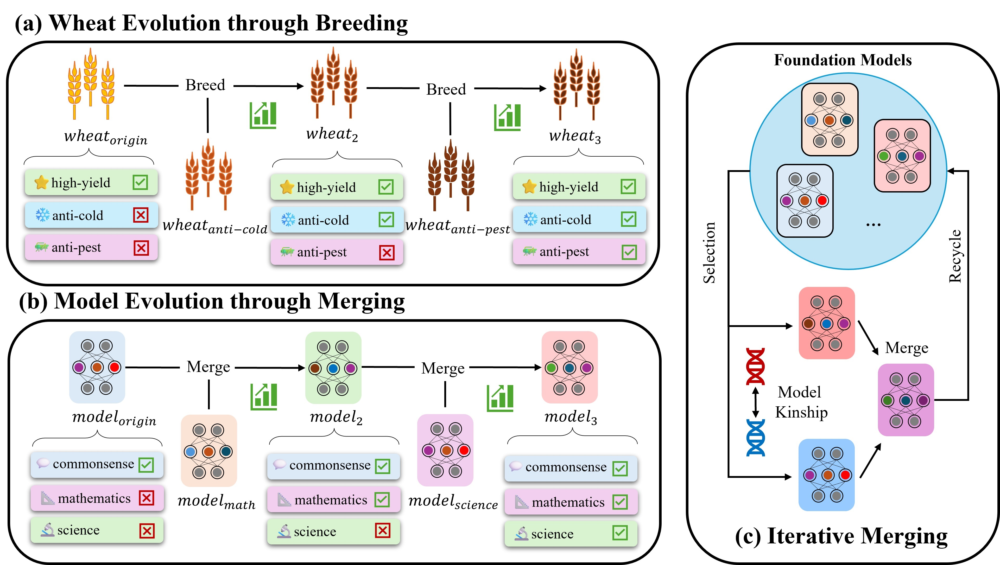

<div align="center">
<h1 align="center"> Exploring Model Kinship for Merging Large Language Models </h1>
<b align="center">The degree of
similarity or relatedness between LLMs, analogous to biological evolution</b>

[](https://opensource.org/licenses/MIT)


</div>

We introduce **model kinship**, the degree of similarity or relatedness between LLMs for merging LLMs, analogous to biological evolution. Currently, we support **Model Kinship** with 3 Similarity Metrics, other metrics will be supported in the future. 

---

## Table of Contents

- [Overview](#overview)
- [Installation](#installation)
- [Usage](#usage)
- [Reproduction](#reproduction)
- [Supported Metrics](#supported-metrics)
- [Notebook](#notebook)
- [Acknowledgement](#acknowledgement)

## Overview

Model merging provides a novel paradigm to leverage information from multiple models without the need of additional training. The recent development of a model merging toolkit allows non-experts to conduct model merging experiments, leading to a trend of merging models on the Hugging Face Open LLM Leaderboard. 

For now, the model merging community has built powerful models through multiple merge steps. This process is akin to artificial selection, a concept in biology in which humans consciously select for or against particular features in organisms.



However, the reasons behind the success of this process remain unknown, resulting in numerous trial-and-error attempts for slight performance improvements.
Inspired from the evolutionary biology, our project explore using information about capabilities acquired during post pre-training (e.g., fine-tuning, merging), which we called **'model kinship'**, to seek for more efficient methods for model optimization.

This toolkit provides a simple way to calculate metrics that can be possibly used as the **'model kinship'** in model merging.

---

## Installation

```bash
git clone https://github.com/zjunlp/ModelKinship.git
pip install -e ./ModelKinship
```

---

## Usage

```bash
# Input Format
merge_cal model-1 model-2 model-base metrics

# Calculate Model Kinship based on Euclidean Distance (CPU)
merge_cal OpenPipe/mistral-ft-optimized-1218 \
mlabonne/NeuralHermes-2.5-Mistral-7B \
mistralai/Mistral-7B-v0.1 \
ed

# Multiple Calculation (CPU)
merge_cal OpenPipe/mistral-ft-optimized-1218 \
mlabonne/NeuralHermes-2.5-Mistral-7B \
mistralai/Mistral-7B-v0.1 \
cs,pcc,ed
```
---

## Reproduction
To reproduce our experiments, both an evaluation toolkit and a merging toolkit for large language models are required. We recommend using the following tools:

- [lm-evaluation-harness by EleutherAI](https://github.com/EleutherAI/lm-evaluation-harness)
- [mergekit by arcee-ai](https://github.com/arcee-ai/mergekit)

Merged Models in Our Experiments are Open Access:
- [Merged Models Repository](https://huggingface.co/PotatoB)

---

## Supported Metrics:
- Cosine Similarity - cs
- Pearson Correlation Coefficient - pcc
- Euclidean Distance - ed

---

## Notebook:

To conduct iterative merging experiments, you can use following notebook for a quick start.

- [Notebook for Iterative Merging](https://colab.research.google.com/drive/141VAI89emgSIcwkswATEXSEENoAMywTO?usp=sharing)

This notebook includes 3 main functions:
- Selection - calculate the model kinship to predict the potential benefit of providing merge.
- Merging - merge the providing models.
- Recycling - upload the merged model.
---

## Acknowledgement

We would like to express our gratitude to the developers and contributors of the following external toolkits, which were instrumental in the success of our research on model merging and kinship analysis:

- [lm-evaluation-harness by EleutherAI](https://github.com/EleutherAI/lm-evaluation-harness) for providing a comprehensive evaluation framework for large language models.
- [mergekit by arcee-ai](https://github.com/arcee-ai/mergekit) for offering an essential toolkit for model merging experiments.

These toolkits have significantly contributed to our ability to conduct and reproduce large-scale experiments, and their open-source availability has been invaluable to the broader research community.

---
